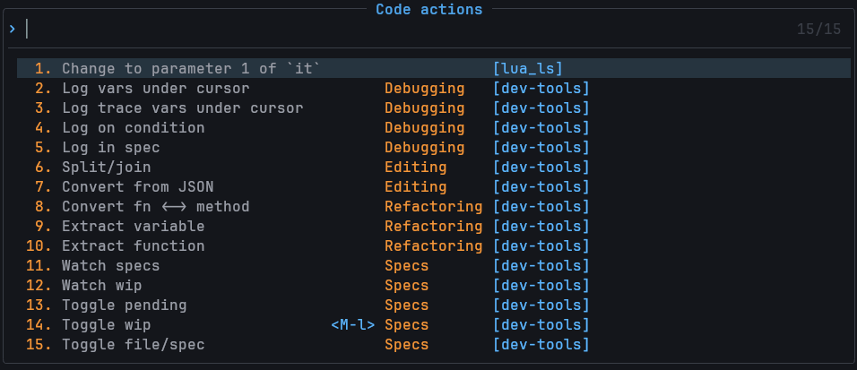
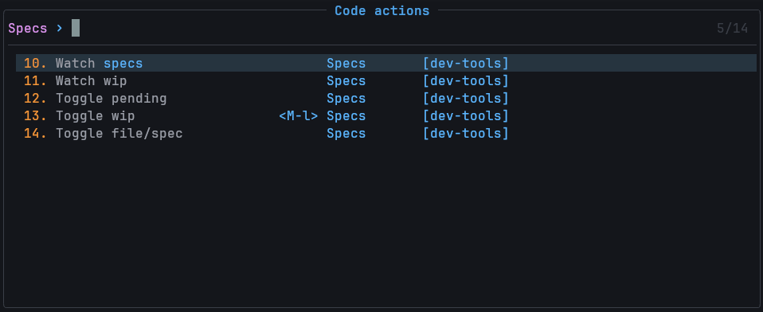

# dev-tools.nvim

A Neovim plugin that provides an in-process LSP server, a community library and a convenient interface for customization and enhancement of your Neovim with custom code actions.

## Features

- 🚀 In-process LSP server for code actions
- 🧩 Simple, intuitive interface and helpers for managing and creating code actions
- 📚 Community-driven library of useful code actions

## Installation and setup

Using [lazy.nvim](https://github.com/folke/lazy.nvim):

```lua
{
  'yarospace/dev-tools.nvim',
  dependencies = { "nvim-treesitter/nvim-treesitter" },
  specs = {
    {
      "folke/snacks.nvim",
      opts = { picker = { enabled = true } },
    },
  },
  ---@type Config
  opts = {
    actions = {},

    filetypes = { -- filetypes for which to attach the LSP
      include = {},
      exclude = {},
    },

    builtin_actions = {
      include = {}, -- filetype/category/title of actions to include
      exclude = {}, -- filetype/category/title of actions to exclude or true to exclude all
    },

    override_ui = true, -- override vim.ui.select with dev-tools actions picker
    debug = false, -- extra debug info on errors
    cache = true, -- cache actions at startup (disable when developing actions)
  }
}
```

> [!NOTE]
> Dev-tools picker uses Snacks.nvim picker module, which is included as a dependency.  If you do not wish to use it, you can set `opts.override_ui = false` and remove Snacks from the `specs` section.

## Usage

- Code actions are accessible via the default LSP keymaps, e.g. `gra`, `<leader>ca`, `<leader>la`, etc. 
- Last action is dot-repeatable.

Dev-tools actions picker is an enhanced version of the default picker, which provides extra info about the actions, live filtering and actions keymaps.



- Specifying `keymap` in the action spec will add a keymap to the action in the picker.
- `<C-b>` will cycle through categories filter



## Adding code actions

- Custom actions can be added to the `opts.actions` table in your configuration  
or registered via `require('dev-tools').register_action({})`

```lua
---@class Action
---@field title string - title of the action
---@field category string|nil - category of the action
---@field filter string|nil|fun(ctx: Ctx): boolean - function or pattern to match against buffer name
---@field filetype string[]|nil - filetype to limit the action to
---@field keymap string|nil - acton keymap (local to picker)
---@field fn fun(action: ActionCtx) - function to execute the action

---@class ActionCtx: Action
---@field ctx Ctx - context of the action

---@class Ctx
---@field buf number - buffer number
---@field win number - window number
---@field row number - current line number
---@field col number - current column number
---@field line string - current line
---@field ts_node TSNode|nil - current TS node
---@field ts_type string|nil - type of the current TS node
---@field ts_range table<number, number, number, number>|nil - range of the current TS node
---@field bufname string - full path to file in buffer
---@field root string - root directory of the file
---@field filetype string - filetype
---@field range Range|nil - range of the current selection
---@field edit Edit - edititng functions

---@class Range
---@field start {line: number, character: number} - start position of the range
---@field end {line: number, character: number} - end position of the range
---@field rc table<number, number, number, number> - row/col format

opts = {
  ---@type Action[]
  actions = {
    {
      title = "Extract variable",
      filetype = { "lua" },
      fn = function(action)
        local ctx = action.ctx

        vim.ui.input({ prompt = "Variable name:", default = "" }, function(var_name)
          if not var_name then return end

          local var_body = ("local %s = %s"):format(var_name, ctx.edit:get_range()[1])

          ctx.edit:set_range { var_name }
          ctx.edit:set_lines({ var_body }, ctx.range.rc[1], ctx.range.rc[1])

          ctx.edit:indent(ctx.range.rc[1] - 1, ctx.range.rc[3] + 1)
          ctx.edit:set_cursor(ctx.range.rc[1] + 2, ctx.range.rc[2] + 1)
        end)
      end,
    },
  }
}
```

There are several helper functions to make it easier to create actions:

```lua
---@class Edit: Ctx
---@field get_lines fun(self: Edit, l_start?: number, l_end?: number): string[] - get lines in the buffer
---@field set_lines fun(self: Edit, lines: string[], l_start?: number, l_end?: number) - set lines in the buffer
---@field get_range fun(self: Edit, ls?: number, cs?: number, le?: number, ce?: number): string[] - get lines in the range of the buffer
---@field set_range fun(self: Edit, lines: string[], ls?: number, cs?: number, le?: number, ce?: number) - set lines range of the buffer
---@field get_node fun(self: Edit, types: string|string[], node?: TSNode|nil, predicate?: fun(node: TSNode): boolean| nil): TSNode|nil, table <number, number, number, number>|nil - traverses up the tree to find the first TS node matching specified type/s
---@field get_previous_node fun(self: Edit, node: TSNode, allow_switch_parents?: boolean, allow_previous_parent?: boolean): TSNode|nil - get previous node with same parent
---@field get_node_text fun(self: Edit, node?: TSNode): string|nil - get the text of the node
---@field indent fun(self: Edit, l_start?: number, l_end?: number) - indent range in the buffer
---@field set_cursor fun(self: Edit, row?: number, col?: number) - set the cursor in the buffer
```

## Contributing

This project is originally thought out as community driven. 

The goal is to provide a simple and intuitive interface for creating and managing code actions, as well as a collection of useful code actions that can be used out of the box.
Your contributions are highly desired and appreciated!

All actions are stored in `/lua/dev-tools/actions/`.  Actions specific to a language can be put under the relevant subdirectory.

```lua
---@class Actions
---@field category string - category of actions
---@field filetype string[]|nil - filetype to limit the actions category to
---@field actions Action[] - list of actions

---@class Action
---@field title string - title of the action
---@field category string|nil - category of the action
---@field filter string|nil|fun(ctx: Ctx): boolean - function or pattern to match against buffer name
---@field filetype string[]|nil - filetype to limit the action to
---@field keymap string|nil - acton keymap (local to picker)
---@field fn fun(action: ActionCtx) - function to execute the action

---@type Actions
return {
  category = "Refactoring",
  filetype = { "lua" },
  actions = {
    {
      title = "Extract variable",
      filter = "_spec",
      fn = function(action)
        ---
      end,
    },
    {
      title = "Extract function",
      filter = function(ctx) return ctx.root:match("project") end,
      keymap = "<C-e>",
      fn = function(ctx)
        --
      end,
    },
  },
}
```

## Available actions

### Lua

#### Refactoring

- [x] Extract variable
- [x] Extract function

#### Editing

- [x] Split/join function/table/conditional
- [x] Convert JSON to Lua table

#### Specs

- [x] Run/watch all specs
- [x] Run/watch current spec

#### Specs

- [x] Switch between code and spec files
- [x] Toggle pending
- [x] Toggle #wip tag

#### Debugging

- [x] Log variable under cursor
- [x] Log with trace
- [x] Log on condition
- [x] Log in spec

## License

MIT
